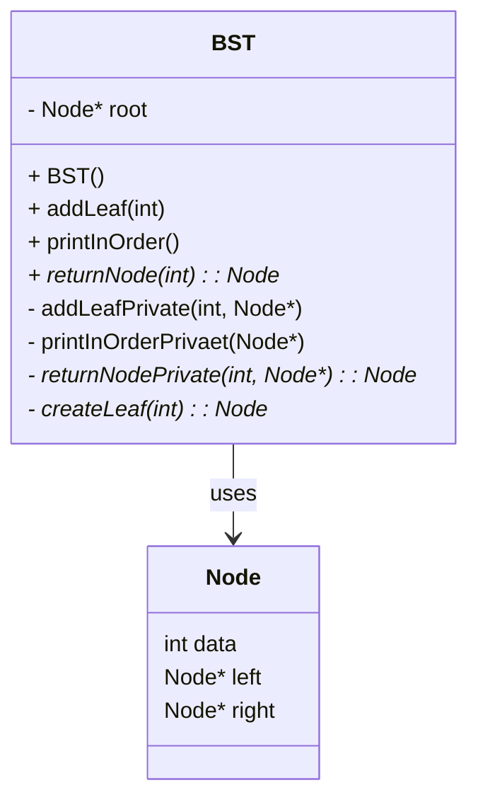
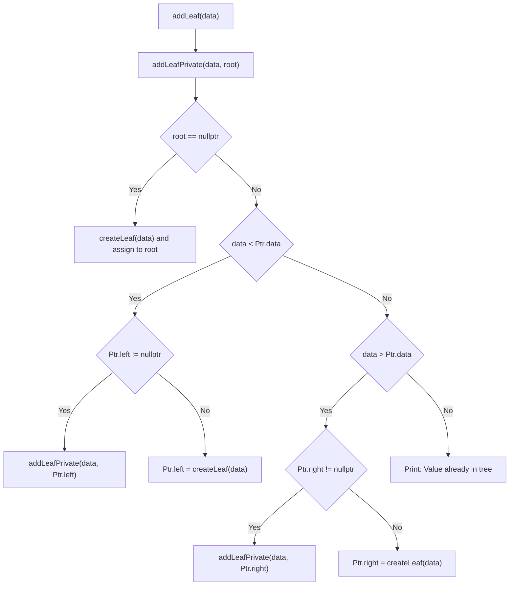
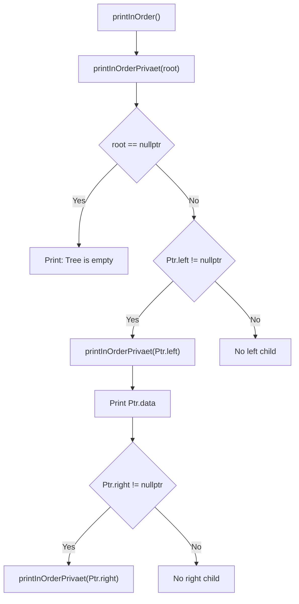
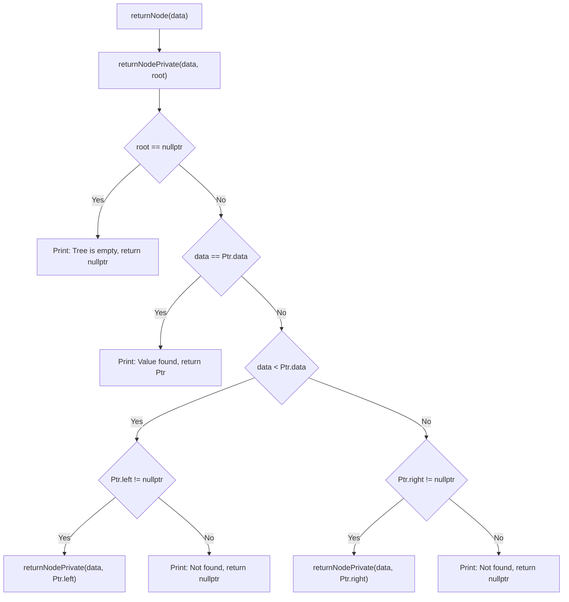

# Binary Search Tree (BST) in C++

This project implements a **Binary Search Tree (BST)** in C++. It allows inserting nodes, printing the tree in in-order, and searching for a specific value.

---

## 📁 File Structure

```
├── BST.h          # BST class declaration
├── BST.cpp        # BST class implementation
├── main.cpp       # Example usage (not shown here)
└── README.md      # This documentation
```

---

## 📦 Class Diagram



---

## 🌱 `addLeaf()` Logic



---

## 🧾 In-order Traversal Logic



---

## 🔍 Search Logic (`returnNode()`)



---

## ✅ How to Build and Run

### Compile:
```bash
g++ -std=c++11 main.cpp BST.cpp -o bst
```

### Run:
```bash
./bst
```

> Ensure `main.cpp` includes usage of `addLeaf()`, `printInOrder()`, and `returnNode()` for testing.

---

## 📝 Notes

- Tree nodes are dynamically allocated with `new`.
[동적 트리노드 생성]
- No delete functionality is included.[레슨 01에서는 바이너리서치 트리 insert만 ]
- Duplicate values are not inserted.
(중복되는 값 삽입 안함)
---

## 📌 Requirements

- C++11 or newer
- g++ compiler
- Recommended: VS Code + Markdown Preview Mermaid Support extension for diagram previews

---


