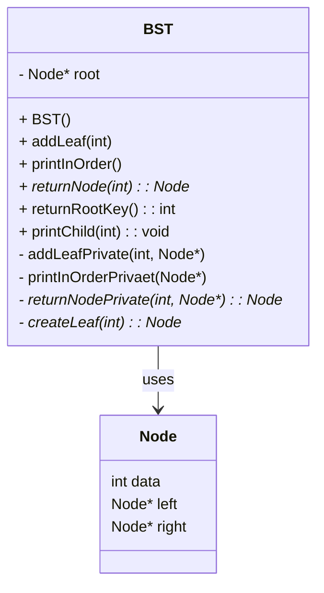
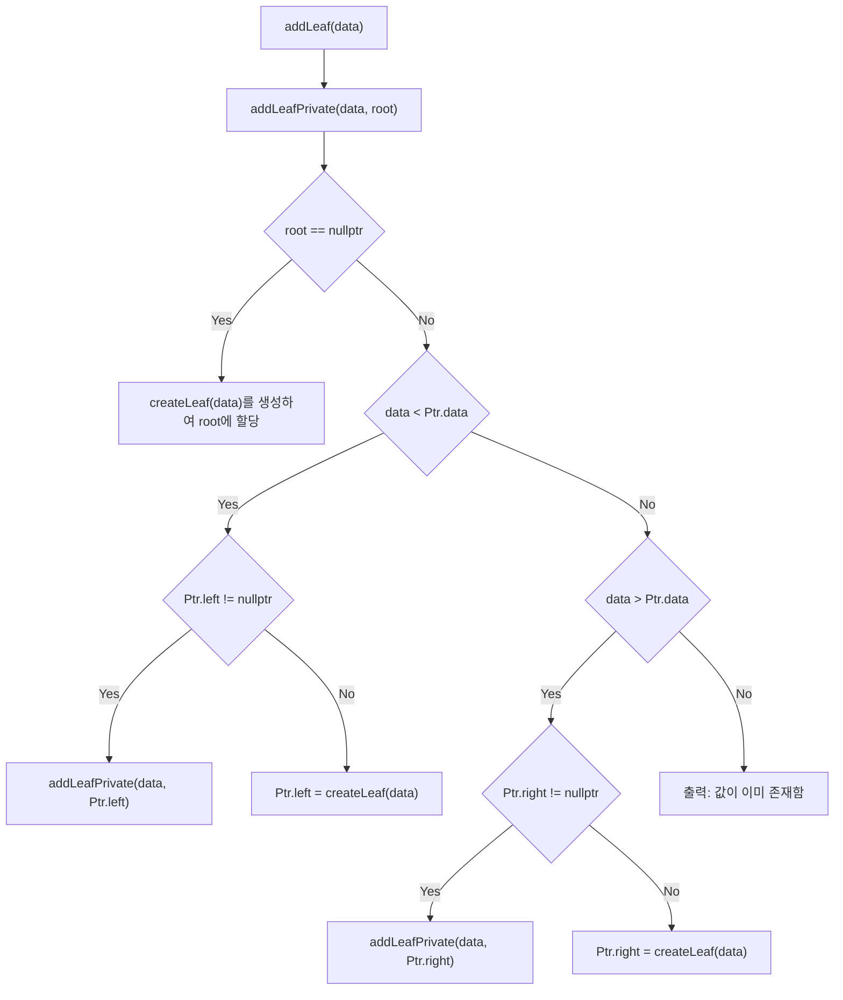
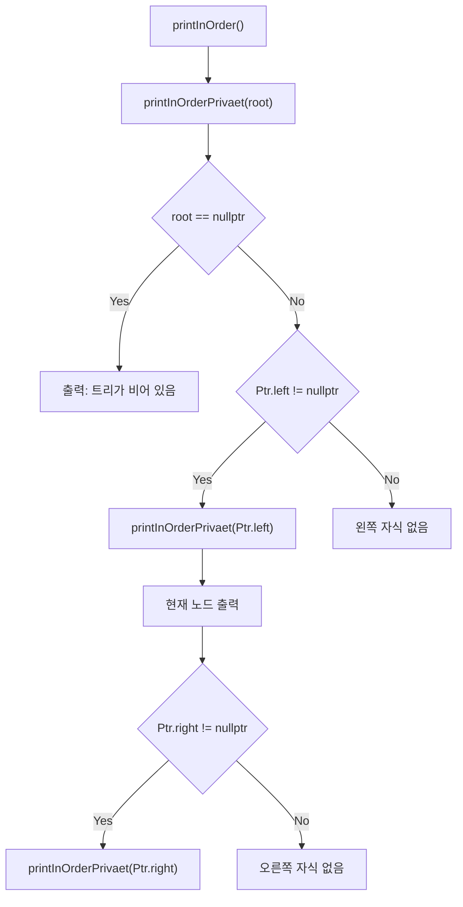
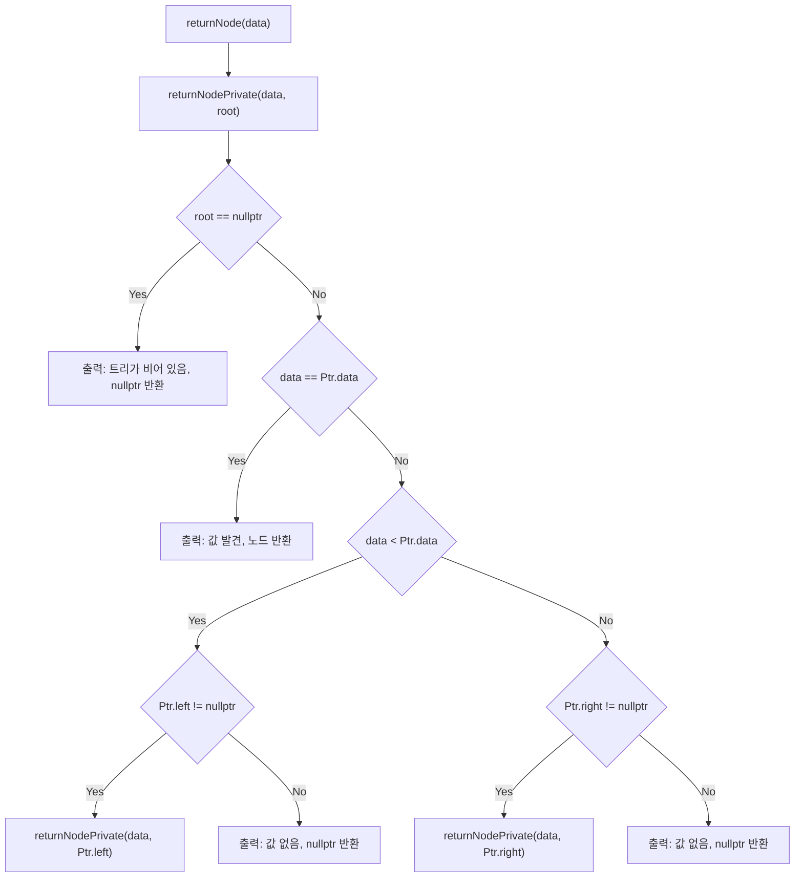

# 이진 탐색 트리 (Binary Search Tree, BST) - C++ 구현

이 프로젝트는 C++로 작성된 **이진 탐색 트리(BST)**를 구현합니다. 노드 삽입, 중위 순회 출력, 특정 값 검색 등의 기능을 포함합니다.

---

## 📁 파일 구조

```
├── BST.h          # BST 클래스 선언부
├── BST.cpp        # BST 클래스 구현부
├── main.cpp       # 사용 예제 (여기엔 포함되지 않음)
└── README.md      # 이 문서
```

---

## 📦 클래스 다이어그램



---

## 🌱 `addLeaf()` 함수 로직



---

## 🧾 중위 순회 로직 (`printInOrder()`)



---

## 🔍 검색 로직 (`returnNode()`)



---

## 🌳 자식 노드 정보 출력 (`printChild()`)

다음 함수는 입력된 값에 해당하는 노드의 **왼쪽 및 오른쪽 자식 노드**를 출력합니다.

```cpp
void BST::printChild(int data){
    Node* node = returnNode(data);
    if(node != nullptr){
        if(node->left != nullptr){
            cout << "Left child: " << node->left->data << endl;
        }else{
            cout << "No left child" << endl;
        }
        if(node->right != nullptr){
            cout << "Right child: " << node->right->data << endl;
        }else{
            cout << "No right child" << endl;
        }
    }else{
        cout << "Node not found" << endl;
    }
}
```

---

## ✅ 컴파일 및 실행 방법

### 컴파일

```bash
g++ -std=c++11 main.cpp BST.cpp -o bst
```

### 실행

```bash
./bst
```


---

## 📝 참고 사항

- 노드는 `new` 연산자로 동적 생성됩니다.
- 삭제 기능은 포함되어 있지 않습니다.
- 중복 값은 삽입되지 않습니다.

---

## 📌 요구 사항

- C++11 이상
- g++ 컴파일러
- 권장 도구: VS Code + Mermaid 미리보기 확장

---


