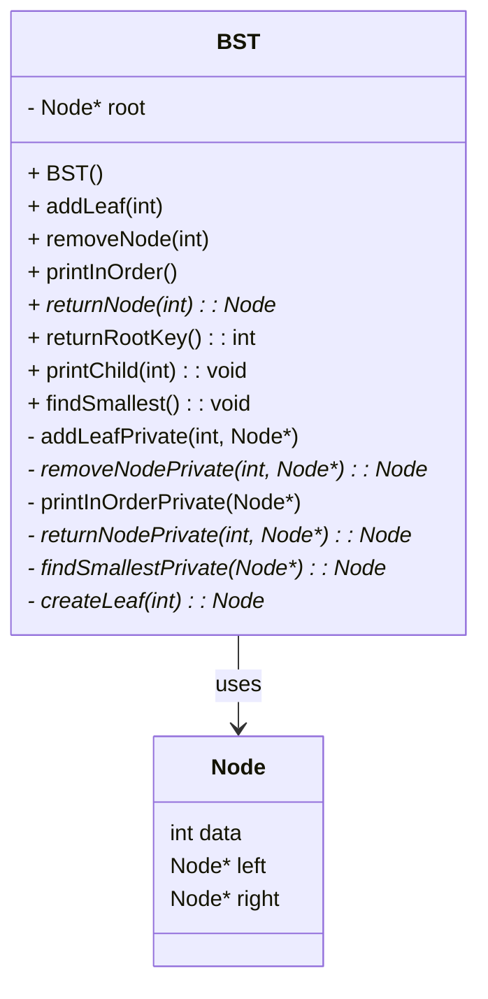

# 이진 탐색 트리 (Binary Search Tree, BST) - C++ 구현

이 프로젝트는 C++로 작성된 **이진 탐색 트리(BST)**를 구현합니다. 노드 삽입, 중위 순회 출력, 특정 값 검색 및 노드 삭제 등의 기능을 포함합니다.

---

## 📁 파일 구조

```
├── BST.h          # BST 클래스 선언부
├── BST.cpp        # BST 클래스 구현부
├── main.cpp       # 사용 예제 (여기엔 포함되지 않음)
└── README.md      # 이 문서
```

---

## 📦 클래스 다이어그램



---

## 🌱 삽입 로직 (`addLeaf()`)

### ✅ 삽입 예시

```
        8
       / \
      3   10
     /
    1
```

### 📌 삽입 규칙
| 상황 | 처리 방법 |
|------|-----------|
| 삽입 값 < 현재 노드 | 왼쪽으로 이동 |
| 삽입 값 > 현재 노드 | 오른쪽으로 이동 |
| 중복 값 | 삽입하지 않음 |

---

## 🧹 삭제 로직 (`removeNode()`)

삭제하려는 노드의 자식 유무에 따라 다음 세 가지 경우로 나눕니다.

### ✅ [Case 1] 리프 노드 (자식 없음)
- 바로 삭제

```
    8
   / \
  3   10
 /
1   ← 삭제 대상
```

---

### ✅ [Case 2] 자식 1개
- 부모 노드가 자식 노드를 대신 연결

```
    8
   / \
  3   10
 /
1
 \
  2   ← 1 삭제 후, 2가 3의 왼쪽 자식이 됨
```

---

### ✅ [Case 3] 자식 2개
- 오른쪽 서브트리에서 **가장 작은 값**을 가져와 대체 후, 그 노드를 삭제

### ▶ 삭제 전:
```
        8
       / \
      3   10
         /  \
        9    14
            /
          13
         /
       12
```

### ▶ 오른쪽 서브트리의 최소값 = 12
- 10 자리를 12로 대체

### ▶ 삭제 후:
```
        8
       / \
      3   12
         /  \
        9    14
            /
          13
```

---

## 🔍 검색 로직 (`returnNode()`)

```text
- 현재 노드가 null이면: 트리 비어 있음
- 찾는 값 == 현재 노드 값: 반환
- 찾는 값 < 현재 노드 값: 왼쪽 자식으로 이동
- 찾는 값 > 현재 노드 값: 오른쪽 자식으로 이동
```

---

## 🌳 자식 노드 정보 출력 (`printChild()`)

입력된 값에 해당하는 노드의 왼쪽 및 오른쪽 자식 정보를 출력합니다.

---

## 🧾 최소값 찾기 (`findSmallest()`)

트리의 가장 왼쪽 노드를 찾아 출력합니다.

```cpp
void BST::findSmallest() {
    Node* smallest = findSmallestPrivate(root);
    if (smallest != nullptr) {
        cout << "Smallest value in the tree: " << smallest->data << endl;
    } else {
        cout << "Tree is empty" << endl;
    }
}
```

---

## ✅ 컴파일 및 실행 방법

### 컴파일
```bash
g++ main.cpp BST.cpp -o bst
```

### 실행
```bash
./bst
```

---

## 📝 참고 사항

- 함수 `printInOrderPrivate()`는 오타 수정이 필요합니다 (`Privaet` → `Private`)
- `printInOrderPrivate()` 내부에서는 `Ptr == nullptr` 체크를 사용해야 재귀 함수로서 안전하게 작동합니다.
- 중복된 값은 삽입되지 않도록 처리되어 있습니다.
- 트리가 비어 있는 경우를 위한 예외 처리가 포함되어 있습니다.

---

## 📌 요구 사항

- C++11 이상
- g++ 컴파일러
- 권장 도구: VS Code + Mermaid 미리보기 확장

---

## 📎 라이선스

MIT License

